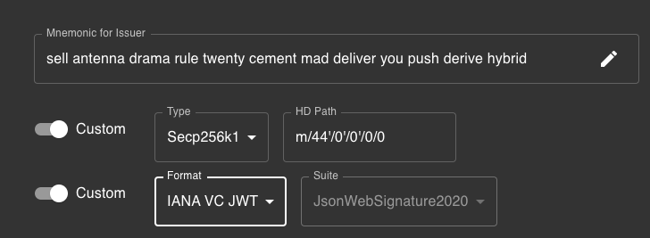
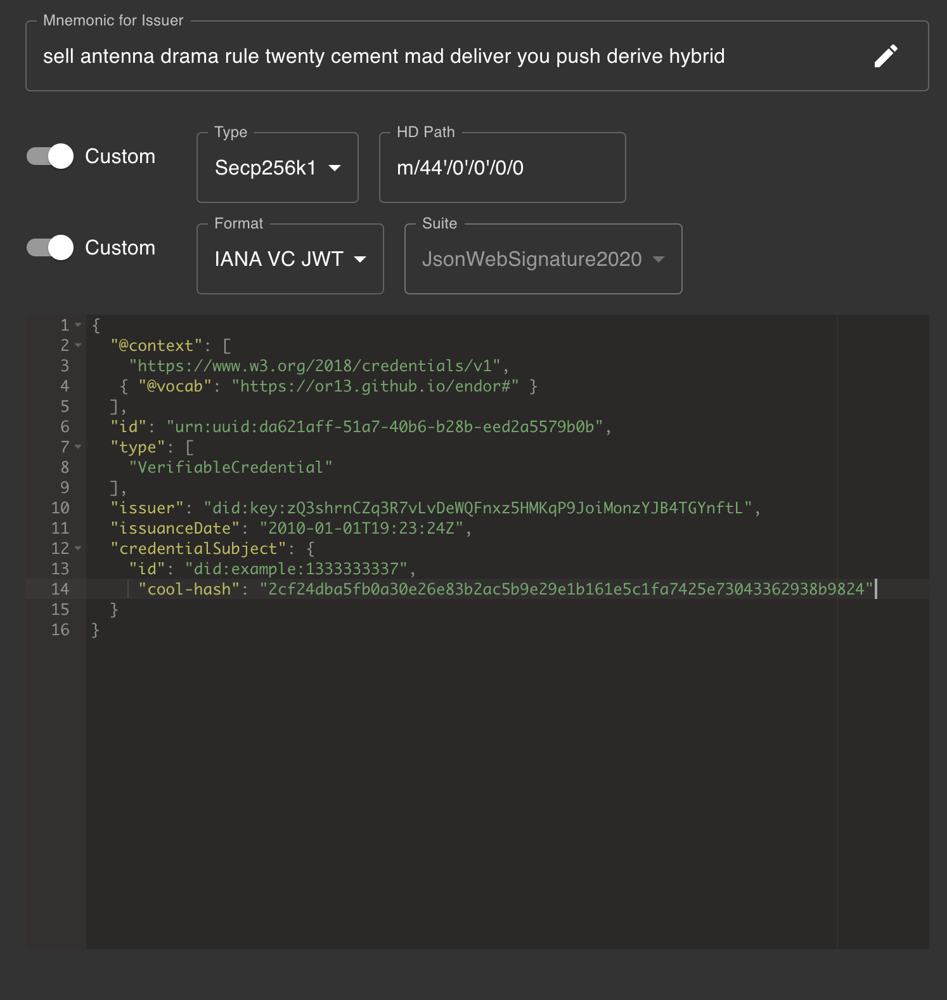

# Endor

[](https://github.com/OR13/endor/actions/workflows/Review.yml) [](https://github.com/OR13/endor/actions/workflows/Endorse.yml)

> Verifiable Credential Endorsement PoC inspired by SCITT.


For demonstration purposes only.

- [issuers](https://or13.github.io/endor/issuers)
- [claims](https://or13.github.io/endor/claims)
- [policy](https://or13.github.io/endor/policy)
- [endorsements](https://or13.github.io/endor/endorsements)

## Introduction

Learn more by visiting [ietf-scitt](https://github.com/ietf-scitt).

🚧 This repo contains a tiny PoC.

This PoC does not reflect current of future SCITT architecture,
it is meant to explore the actors and models associated with transparency registries.

In particular, this repository focuses on issuers that rely on DIDs and Payloads / Artifacts that are Verifiable Credentials.

These choices were made to leverage some existing visualization tooling,
and libraries, but a similar setup can be achieved with x509 and COSE.

This repository uses a GitHub Repository as a "Transparent Registry" and provides "Full Transparency", meaning both claims and endorsements are public.

While this makes it easier to explore the concepts it does not reflect a realistic security architecture.

🚧 This repository is for experimenting / and not reflective of anything approaching the proposed SCITT architecture.

### Issuers

Entities such as people, organizations or devices that make statements about an artifact or subject.

🧸 In this PoC I have chosen to represent issuers using W3C Decentralized Identifiers.

### Claims

A set of statements about a subject protected by a signature from an issuer.

🧸 In this PoC I have chosen to represent claims using W3C Verifiable Credentials.

### Policy Documents

Security documents describing the rules for validating a claim for consideration in the registry.

🧸 In this PoC I have chosen to represent policy documents using JSON Schema.

🧸 In this PoC I have chosent to automate the claim review process by leveraging GitHub Worflows,
such that a review of claims for conformance is automatically created after a pull request against the `main` branch is opened.

See [https://github.com/OR13/endor/actions/workflows/Review.yml](https://github.com/OR13/endor/actions/workflows/Review.yml).

### Notary

Entities such as people, organizations or devices that have some trust relationship with an issuer,
and can provide some assurance to the issuer's identifiers and authenticity.

A notary keeps a ledger or registry of their endorsements.

🧸 In this PoC I have chosen to represent the transparent registry using a GitHub repository.

### Endorsements

A counter signature for a claim from a notary, representing that the issuer has been authenticated under some assurance level,
but not representing any evaluation of the payload or claims made by the issuer about a subject.

🧸 In this PoC I have chosen to represent endorsements using W3C Verifiable Credentials.

🧸 In this PoC I have chosen to automate the process of creating endorsements by leveraging GitHub Worflows,
such that endorsements are automatically created after a pull request to the `main` branch has been merged.

See [https://github.com/OR13/endor/actions/workflows/Endorse.yml](https://github.com/OR13/endor/actions/workflows/Endorse.yml).

# Try it out!

Fork the repo, and [use this tool](https://api.did.actor/issue) to create a `/docs/inbox/claim.json` file.

In the tool, make sure to select the following signing settings:



Then paste this:

```json
{
  "@context": [
    "https://www.w3.org/2018/credentials/v1",
    { "@vocab": "https://or13.github.io/endor#" }
  ],
  "id": "urn:uuid:a86f8c83-fe00-4aff-83b7-f6e55c4ebf20",
  "type": ["VerifiableCredential"],
  "issuer": "did:key:zQ3shrnCZq3R7vLvDeWQFnxz5HMKqP9JoiMonzYJB4TGYnftL",
  "issuanceDate": "2010-01-01T19:23:24Z",
  "credentialSubject": {
    "id": "did:example:123",
    "cool-hash": "2cf24dba5fb0a30e26e83b2ac5b9e29e1b161e5c1fa7425e73043362938b9824"
  }
}
```

You can experiment with using other issuer identifiers by changing the mnemonic and/or path values.

Just beware that the `@context` needs to match teh above example or you may fail to issue verifiable credentials.

You will need to click the pencil to issue the credential as a JWT.

You will need to use that JWT to create the `claim.json` file, and it should look like the `example.json` file, next to it. 

Once you have the `/docs/inbox/claim.json` file in a branch, open a pull request against this repository.

You should have only this file in the change set.

A reviewer (@OR13b) will have to approve and run CI to validate your claim.

If the review passes:

- I will merge your pull request
- The registry will automatically update
- A link for your endorsed claim will appear [here](https://or13.github.io/endor/endorsements/index.json)

If you want to test out the process see the npm commands under usage below.

## Usage

### Prepare a claim

```
npm run claim:prepare
```

This command will create a `./docs/inbox/claim.json` from `./docs/inbox/example.json`.

You can also generate your own unique claim using this tool:

[api.did.actor/issue](https://api.did.actor/issue)



After configuring the credential, click the "pencil" to issue it.

You will end on a URL that looks like this: [https://api.did.actor/v/eyJhbGc...](https://api.did.actor/v/eyJhbGciOiJFUzI1NksiLCJraWQiOiJkaWQ6a2V5OnpRM3Nocm5DWnEzUjd2THZEZVdRRm54ejVITUtxUDlKb2lNb256WUpCNFRHWW5mdEwjelEzc2hybkNacTNSN3ZMdkRlV1FGbnh6NUhNS3FQOUpvaU1vbnpZSkI0VEdZbmZ0TCJ9.eyJpc3MiOiJkaWQ6a2V5OnpRM3Nocm5DWnEzUjd2THZEZVdRRm54ejVITUtxUDlKb2lNb256WUpCNFRHWW5mdEwiLCJzdWIiOiJkaWQ6ZXhhbXBsZToxMzMzMzMzMzM3IiwidmMiOnsiQGNvbnRleHQiOlsiaHR0cHM6Ly93d3cudzMub3JnLzIwMTgvY3JlZGVudGlhbHMvdjEiLHsiQHZvY2FiIjoiaHR0cHM6Ly9vcjEzLmdpdGh1Yi5pby9lbmRvciMifSwiaHR0cHM6Ly93d3cudzMub3JnLzIwMTgvY3JlZGVudGlhbHMvdjEiXSwiaWQiOiJ1cm46dXVpZDpkYTYyMWFmZi01MWE3LTQwYjYtYjI4Yi1lZWQyYTU1NzliMGIiLCJ0eXBlIjpbIlZlcmlmaWFibGVDcmVkZW50aWFsIl0sImlzc3VlciI6ImRpZDprZXk6elEzc2hybkNacTNSN3ZMdkRlV1FGbnh6NUhNS3FQOUpvaU1vbnpZSkI0VEdZbmZ0TCIsImlzc3VhbmNlRGF0ZSI6IjIwMTAtMDEtMDFUMTk6MjM6MjRaIiwiY3JlZGVudGlhbFN1YmplY3QiOnsiaWQiOiJkaWQ6ZXhhbXBsZToxMzMzMzMzMzM3IiwiY29vbC1oYXNoIjoiMmNmMjRkYmE1ZmIwYTMwZTI2ZTgzYjJhYzViOWUyOWUxYjE2MWU1YzFmYTc0MjVlNzMwNDMzNjI5MzhiOTgyNCJ9fSwianRpIjoidXJuOnV1aWQ6ZGE2MjFhZmYtNTFhNy00MGI2LWIyOGItZWVkMmE1NTc5YjBiIiwibmJmIjoxMjYyMzczODA0fQ.-RH5e1HEsg_dwa_kcZfyVPgaqYubOvINmdry81ogOtJxpQSwaknpsv9GCLr_Bg931re83oTC5kISfz3SOEEq4w)

Everything after `https://api.did.actor/v/` is a JWT.

You can use this as your `claim.json`

### Review a claim

```
npm run claim:review
```

### Endorse a claim

```
npm run claim:endorse
```

### Test the Registry

```
npm run registry:test
```

### Update the Registry

```
npm run registry:update
```

### Drop the Registry

```
npm run registry:drop
```

# 🚨 Security Issues 🚨

This repository contains private keys for demonstration purposes.

This repository uses `did:key` which has no revocation or expiration mechanism... for demonstration purposes only.

This PoC is a hypothetical example.

This PoC is not safe, I made it to explore ideas.
